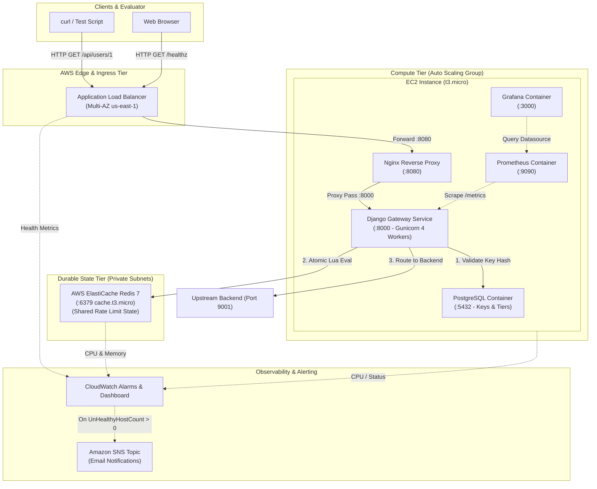
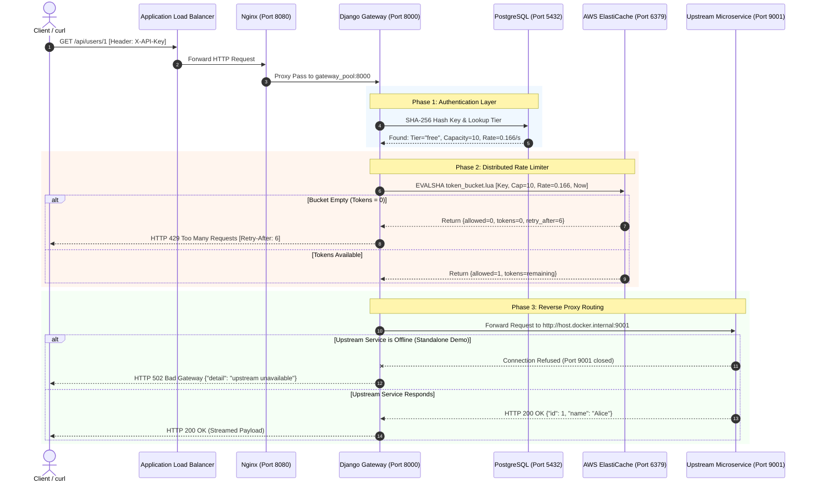

# High Availability Distributed Rate Limiter & API Gateway
## Comprehensive Engineering Architecture & Technical Guide

---

## 1. Executive Summary & Project Purpose

In modern cloud computing and microservice ecosystems, directly exposing internal backend microservices to the public internet presents critical risks:
- **Security Vulnerabilities**: Direct exposure creates vectors for unauthorized access, parameter tampering, and credential stuffing.
- **Resource Starvation**: Unrestricted traffic from aggressive or malicious clients can saturate backend servers (the "noisy-neighbor" problem).
- **Service Outages**: Spikes in traffic or Distributed Denial of Service (DDoS) attacks can cascade and bring down downstream databases and services.

This project implements an **enterprise-grade, production-ready API Gateway with Distributed Rate Limiting**, backed by a **High Availability (HA) & Self-Healing Cloud Architecture on AWS**, provisioned entirely via **Infrastructure as Code (Terraform)** within the constraints of the **AWS Free Tier**.

### Core Capabilities
1. **Unified Entry Point & Reverse Proxy**: Acts as a single, hardened point of ingress that abstracts downstream microservices and routes traffic dynamically.
2. **Tier-Based Client Authentication**: Employs cryptographically secure API keys mapped to SLA tiers (`free`, `pro`, `enterprise`) stored securely using SHA-256 hashing.
3. **Atomic Distributed Rate Limiting**: Employs Redis Lua scripts executed via `EVALSHA` to enforce rate-limiting algorithms atomically directly inside Redis memory, eliminating race conditions across distributed gateway nodes.
4. **Cloud High Availability & Self-Healing**: Automatically detects node or container failures via Application Load Balancer health checks and triggers an Auto Scaling Group (ASG) to terminate unhealthy instances and launch replacements in an alternate Availability Zone (AZ) without human intervention.
5. **Decoupled Stateful vs. Stateless Architecture**: Compute instances are treated as disposable and ephemeral ("cattle, not pets"); rate-limiting quotas and token balances reside in managed AWS ElastiCache Redis and survive instance termination.
6. **Dual Observability**: CloudWatch metrics, alarms, and SNS email notifications combine with containerized Prometheus and Grafana dashboards for full operational visibility.

---

## 2. High-Level Architecture Diagram

### Cloud & Network Topology (AWS us-east-1)

```
                                     CLIENTS / INTERNET
                                             │
                                             ▼ HTTP (Port 80 / 443)
┌──────────────────────────────────────────────────────────────────────────────────────────────┐
│                                   AWS VPC (10.0.0.0/16)                                      │
│                                                                                              │
│   ┌──────────────────────────────────────────────────────────────────────────────────────┐   │
│   │                 MULTI-AZ APPLICATION LOAD BALANCER (ALB)                             │   │
│   │                 - DNS: apigateway-alb-1861270101.us-east-1.elb.amazonaws.com          │   │
│   │                 - Health Check: GET /healthz every 15s (Matcher: HTTP 200)           │   │
│   │                 - Listener: Port 80 forward to Target Group                          │   │
│   └──────────────────────────────┬───────────────────────────────┬───────────────────────┘   │
│                                  │                               │                           │
│              AZ 1: us-east-1a    │                               │   AZ 2: us-east-1b        │
│              Public Subnet (10.0.0.0/24)                         │   Public Subnet (10.0.1.0/24)
│              ┌───────────────────────────┐                       │   ┌───────────────────────┐
│              │      EC2 (t3.micro)       │◄──────────────────────┘   │  STANDBY AZ SUBNET    │
│              │ [Active Gateway Instance] │                           │  (Replacement instance│
│              │                           │                           │   spins up here if    │
│              │ ┌───────────────────────┐ │                           │   AZ 1 or node fails) │
│              │ │  Nginx Reverse Proxy  │ │ (Port 8080)               └───────────────────────┘
│              │ └──────────┬────────────┘ │
│              │            ▼              │
│              │ ┌───────────────────────┐ │
│              │ │   Django Gateway      │ │ (Port 8000)
│              │ │  - Auth Middleware    │ │
│              │ │  - RateLimit (Lua)    │ │
│              │ │  - Streaming Proxy    │ │
│              │ └──────────┬────────────┘ │
│              │            ▼              │
│              │ ┌───────────────────────┐ │
│              │ │ PostgreSQL Container  │ │ (Port 5432 - API Keys & Tiers)
│              │ └───────────────────────┘ │
│              │                           │
│              │ ┌───────────────────────┐ │
│              │ │ Prometheus & Grafana  │ │ (Ports 9090 & 3000)
│              │ └───────────────────────┘ │
│              └────────────┬──────────────┘
│                           │
│                           │ VPC Private Ingress (Port 6379)
│                           ▼
│   ┌──────────────────────────────────────────────────────────────────────────────────────┐   │
│   │             AWS ELASTICACHE REDIS CLUSTER (cache.t3.micro)                           │   │
│   │             - Engine: Redis 7.0 (Single-node cluster in Multi-AZ subnet group)       │   │
│   │             - Private Subnets: 10.0.10.0/24 (AZ 1) & 10.0.11.0/24 (AZ 2)             │   │
│   │             - Ingress Security Group: Port 6379 restricted ONLY to Gateway SG        │   │
│   │             - PERSISTENT STATE: Survives EC2 crashes and replacement launches        │   │
│   └──────────────────────────────────────────────────────────────────────────────────────┘   │
│                                                                                              │
└──────────────────────────────────────────────────────────────────────────────────────────────┘
```

### Logical Component Interaction



---

## 3. High Availability (HA) & Cloud Engineering Design

### A. Free Tier & Zero-Cost Network Topology
In traditional enterprise architectures, private compute subnets route internet traffic via **AWS NAT Gateways**. However, an AWS NAT Gateway incurs a fixed baseline charge of **~$32.40/month per AZ**, which breaks AWS Free Tier budgets.

#### The Cost-Optimized Engineering Solution:
1. **Public Subnet Compute with Security Boundaries**: EC2 instances reside in public subnets (`10.0.0.0/24` and `10.0.1.0/24`), enabling them to pull code directly from GitHub and install OS packages through the Internet Gateway without NAT Gateways.
2. **Strict Ingress Segmentation via Security Groups**:
   - The Gateway EC2 Security Group **rejects all direct HTTP connections from the internet**.
   - Port `8080` (Nginx) is locked down to accept ingress **only from the ALB Security Group** (`sg-alb`).
   - Port `22` (SSH) is strictly restricted to administrative IP CIDRs (`demo_ssh_cidr`).
3. **Isolated Private Caching**: AWS ElastiCache Redis nodes reside in dedicated **private subnets** (`10.0.10.0/24` and `10.0.11.0/24`) with no internet routing table association. Ingress on port `6379` is accepted exclusively from the Gateway Security Group.

### B. Auto Scaling & Automated Self-Healing Mechanism
The compute tier is engineered for automated failure recovery:
- **Multi-AZ Auto Scaling Group**: Spans two Availability Zones (`us-east-1a` and `us-east-1b`).
- **ELB-Driven Health Checks**: Configured with `health_check_type = "ELB"`. Standard EC2 health checks only detect hypervisor crashes or physical hardware failure. ELB health checks continuously test application-level health via `HTTP GET /healthz`.
- **Target Group Sensitivity**:
  - `healthy_threshold = 2` (30 seconds to join pool).
  - `unhealthy_threshold = 3` (45 seconds to evict failed node).
  - `interval = 15` seconds.
  - `deregistration_delay = 30` seconds (rapid draining).

#### Step-by-Step Self-Healing Lifecycle:
1. **Failure Occurs**: A container crash, Docker daemon stoppage, or kernel panic occurs on the active EC2 instance.
2. **ALB Detection**: The ALB fails to receive HTTP 200 from `/healthz`. After 3 consecutive failed checks (45 seconds), the ALB marks the instance as `unhealthy` and stops forwarding traffic.
3. **Alert Triggered**: CloudWatch alarm `apigateway-unhealthy-hosts` triggers immediately and dispatches an Amazon SNS notification email to the administrator.
4. **ASG Replacement**: The Auto Scaling Group detects the ELB unhealthy status, marks the instance for termination, and launches a fresh EC2 instance in the alternate Availability Zone.
5. **Automated Provisioning**: The new instance executes `user_data.sh`:
   - Installs Docker and Docker Compose.
   - Clones the Git repository.
   - Injects the production environment pointing to the existing AWS ElastiCache Redis endpoint.
   - Runs database migrations and seeds API keys.
6. **Re-Registration**: Once containers pass local Docker health checks, the ALB target group receives HTTP 200 from `/healthz`, marks the instance as `healthy`, and routes traffic to the new node.
7. **Zero State Loss**: Because rate-limiting tokens and request logs are stored in ElastiCache Redis, all existing client quotas and rate-limit penalties are completely preserved.

### C. Persistent vs. Disposable State Separation
A core design principle of cloud-native architecture is treating compute as disposable:
- **Disposable Layer**: Nginx, Django Gunicorn workers, PostgreSQL demo container, and Prometheus/Grafana. If an instance is killed with `sudo systemctl stop docker` or terminated via AWS CLI, no critical state is lost.
- **Durable Layer**: AWS ElastiCache Redis. Redis is decoupled from EC2 and lives in private subnets across AZs. Client rate limits, token refills, and IP quotas remain intact across instance terminations.

---

## 4. Software Architecture & Application Tier

### A. Ingress & Nginx Reverse Proxy
The frontend ingress container runs Alpine Nginx ([`nginx/nginx.conf`](file:///home/ayush/Desktop/APIGateway/nginx/nginx.conf)):
- Acts as a reverse proxy buffering slow client requests to protect upstream Gunicorn Python workers from socket exhaustion.
- Enforces HTTP connection keep-alive and forwards requests to `gateway_pool:8000`.
- Implements custom access logs with request execution time, upstream response time, and client IP extraction via `X-Forwarded-For`.

### B. Client Authentication Architecture
API keys are handled via a high-performance, secure hashing pattern:
1. **Key Generation**: When created, `secrets.token_urlsafe(32)` produces a cryptographically random 256-bit string with a human-readable prefix (e.g., `demo-free`).
2. **Cryptographic Storage**: The plaintext key is **never saved in the database**. PostgreSQL only stores the cryptographic SHA-256 digest (`key_hash`).
3. **Verification**: In [`gateway/authentication/middleware.py`](file:///home/ayush/Desktop/APIGateway/gateway/authentication/middleware.py), when a client provides `-H "X-API-Key: <token>"`, the middleware hashes the token using SHA-256 and queries the database with an indexed lookup:
   ```python
   api_key_obj = APIKey.objects.select_related('tier').get(
       key_hash=hashlib.sha256(raw_key.encode()).hexdigest(),
       is_active=True
   )
   ```
4. **Tier Resolution**: Resolves the client's assigned rate-limit tier (`free`, `pro`, `enterprise`) and attaches it to `request.tier`.

### C. Distributed Rate Limiting: Why Redis Lua Scripts?

#### The Multi-Step Race Condition Problem:
In naive rate limiters, developers implement rate limiting in application code:
```python
# ANTI-PATTERN: Prone to concurrency race conditions!
current_count = redis.get(user_key)
if current_count < limit:
    redis.incr(user_key)
    return ALLOWED
else:
    return DENIED
```
In a distributed environment with multiple instances or concurrent threads, two requests arriving at the exact same millisecond will both read `current_count = 9` (under a limit of 10), and both will increment to 10. Under high concurrency, clients can exceed their rate limit quotas by 200% to 500%.

#### The Atomic Lua Solution:
To achieve 100% atomic enforcement, all rate limiting logic is implemented in **Redis Lua scripts** executed via `EVALSHA`:
1. **Atomicity**: Redis runs Lua scripts on a single thread. Once a script starts, no other Redis command or script can execute until it finishes.
2. **Zero Network Latency**: Calculation of elapsed time, token replenishment, count evaluation, and expiration setting happen in a single operation inside Redis memory in **< 1 millisecond**.

---

## 5. Rate Limiting Algorithms Implemented

### 1. Token Bucket Algorithm (`free` tier)
- **Concept**: A bucket holds up to $C$ tokens. Tokens are continuously added at a constant rate $r$ (tokens/second). Each request costs 1 token. If the bucket has at least 1 token, the request is allowed; otherwise, it is denied.
- **Formula**:
  $$\text{tokens}_{\text{new}} = \min(C, \text{tokens}_{\text{old}} + (t_{\text{now}} - t_{\text{last}}) \times r)$$
- **Key Advantage**: Allows natural traffic bursts (up to bucket capacity) while enforcing a strict long-term average consumption rate.
- **Implementation**: [`gateway/ratelimiter/lua_scripts/token_bucket.lua`](file:///home/ayush/Desktop/APIGateway/gateway/ratelimiter/lua_scripts/token_bucket.lua)

```lua
-- Excerpt from token_bucket.lua
local key = KEYS[1]
local capacity = tonumber(ARGV[1])
local refill_rate = tonumber(ARGV[2])
local now = tonumber(ARGV[3])
local requested = tonumber(ARGV[4])

local bucket = redis.call('HMGET', key, 'tokens', 'last_refill')
local tokens = tonumber(bucket[1])
local last_refill = tonumber(bucket[2])

if tokens == nil then
  tokens = capacity
  last_refill = now
end

-- Refill based on elapsed time since last check
local elapsed = math.max(now - last_refill, 0)
tokens = math.min(capacity, tokens + (elapsed * refill_rate))

local allowed = 0
if tokens >= requested then
  tokens = tokens - requested
  allowed = 1
end

redis.call('HMSET', key, 'tokens', tokens, 'last_refill', now)
redis.call('EXPIRE', key, math.ceil(capacity / refill_rate) * 2)

return {allowed, tokens, retry_after}
```

### 2. Sliding Window Log Algorithm (`pro` tier)
- **Concept**: Uses a Redis Sorted Set (`ZSET`) where each request is stored with its millisecond timestamp as the score.
- **Mechanism**:
  1. Removes all entries older than `now - window_size` via `ZREMRANGEBYSCORE`.
  2. Counts remaining entries via `ZCARD`.
  3. If count < limit, adds current request via `ZADD` and returns allowed.
- **Key Advantage**: Eliminates the 2x burst vulnerability at window boundaries inherent in fixed window counters.
- **Implementation**: [`gateway/ratelimiter/lua_scripts/sliding_window_log.lua`](file:///home/ayush/Desktop/APIGateway/gateway/ratelimiter/lua_scripts/sliding_window_log.lua)

### 3. Fixed Window Counter Algorithm (`enterprise` tier)
- **Concept**: Divides time into fixed discrete buckets (e.g., 60-second windows). Uses Redis `INCRBY` and sets a TTL equal to the window length.
- **Key Advantage**: Highest throughput, lowest memory footprint ($O(1)$ memory per client).
- **Implementation**: [`gateway/ratelimiter/lua_scripts/fixed_window.lua`](file:///home/ayush/Desktop/APIGateway/gateway/ratelimiter/lua_scripts/fixed_window.lua)

---

## 6. End-to-End Request Flow & The "502 Upstream" Explanation

### Sequence Diagram



### Detailed Breakdown: Why `HTTP 502 Bad Gateway` Proves System Success
When testing the live endpoint:
```bash
curl -s -H "X-API-Key: $KEY" -w "\nHTTP %{http_code}\n" $ALB/api/users/1
```
The gateway returns:
```json
{"detail": "upstream unavailable"}
HTTP 502
```

#### Why This Occurs:
1. The request was received by the **AWS Application Load Balancer**.
2. The ALB routed the request to **Nginx** on port 8080.
3. Nginx forwarded the request to **Django Gunicorn workers** on port 8000.
4. The **Authentication Middleware** validated the API key against PostgreSQL.
5. The **Rate Limiter Middleware** executed the atomic Lua script in **AWS ElastiCache Redis**, confirming the client had sufficient tokens.
6. The request reached [`gateway/proxy/views.py`](file:///home/ayush/Desktop/APIGateway/gateway/proxy/views.py). Django inspected `settings.BACKEND_ROUTES`, mapped `/api/users` to `http://host.docker.internal:9001`, and initiated a connection.
7. Because downstream microservices are intentionally omitted in this standalone gateway demo, Python's `requests` library caught `requests.exceptions.ConnectionError` and cleanly returned:
   ```python
   except requests.exceptions.ConnectionError:
       return JsonResponse({'detail': 'upstream unavailable'}, status=502)
   ```
8. **The Core Proof**: When you burst 15 requests in a row, the first 10 requests return `HTTP 502` (passed all gateway checks and attempted upstream forwarding), and requests 11 through 15 return **`HTTP 429 Too Many Requests`**! The 429 proves that the rate limiter intercepted and rejected the requests at the gateway edge before they could reach the proxy layer.

---

## 7. Observability & Telemetry Infrastructure

### A. AWS CloudWatch Metrics & Alarms
- **Dashboard Name**: `apigateway-dashboard`
- **Tracked Metrics**:
  1. `AWS/ApplicationELB` `RequestCount`: Real-time request volume.
  2. `AWS/ApplicationELB` `HealthyHostCount` vs `UnHealthyHostCount`: Health state of EC2 instances.
  3. `AWS/ApplicationELB` `TargetResponseTime` (p95): Latency profile of the gateway.
  4. `AWS/EC2` `CPUUtilization`: CPU load on Auto Scaling Group nodes.
  5. `AWS/ElastiCache` `CPUUtilization` & `DatabaseMemoryUsagePercentage`: Health and capacity of Redis.
  6. `AWS/ApplicationELB` `HTTPCode_ELB_5XX_Count`: Edge infrastructure error count.

- **Configured Metric Alarms**:
  - `apigateway-unhealthy-hosts`: Triggers when `UnHealthyHostCount > 0` for 1 minute.
  - `apigateway-high-cpu`: Triggers when ASG `CPUUtilization > 70%` for 2 evaluation periods.
  - `apigateway-alb-5xx`: Triggers if ALB-generated 5xx errors exceed 5 in a minute.
- **Amazon SNS Integration**: All alarms automatically publish notifications to an SNS Topic that sends email alerts to the system administrator.

### B. Prometheus & Grafana Monitoring Tier
- **Prometheus** (Port 9090): Scrapes Django's `/metrics` endpoint every 5 seconds.
  - Monitors `gateway_rate_limit_decisions_total` broken down by `action` (`allowed` vs `denied`) and `tier`.
  - Tracks latency percentiles and database connection pool saturation.
- **Grafana** (Port 3000): Pre-configured dashboards with anonymous viewer access enabled for live presentations.

---

## 8. Failure Modes & Automated Recovery Matrix

| Failure Scenario | Detection Mechanism | Automated Recovery Action | Recovery Time | State & Data Impact |
|---|---|---|---|---|
| **Django Process Crash** | Docker container health check (`curl /healthz`) | Docker daemon auto-restarts container (`restart: always`) | < 5 seconds | Zero data loss; zero impact on rate limit state. |
| **Total EC2 Crash / Docker Kill** | ALB Target Group health check fails 3 consecutive intervals (45s) | ASG terminates failed instance and launches replacement in alternate AZ | 2.5–3 minutes | PostgreSQL re-seeds; **ElastiCache Redis state 100% preserved**. |
| **Availability Zone (AZ) Outage** | AWS Multi-AZ ELB health probe failure | ALB shifts traffic to healthy AZ; ASG launches instance in surviving AZ | < 60 seconds | Zero downtime once replacement node registers as healthy. |
| **Redis Node Maintenance** | AWS ElastiCache managed cluster supervisor | Managed failover / maintenance window | Managed by AWS | Ephemeral rate limit counters reset to tier capacity; no data loss. |
| **Traffic Spike / DDoS Attack** | Redis Lua script evaluation | Gateway drops excess requests with `HTTP 429` at edge | Immediate (< 1ms) | Upstream backend protected from crash and exhaustion. |

---

## 9. Live Demonstration & Verification Playbook

### Active Live Deployment Endpoints
- **Public ALB URL**: `http://apigateway-alb-1861270101.us-east-1.elb.amazonaws.com`
- **CloudWatch Dashboard**: [Open AWS Console Dashboard](https://us-east-1.console.aws.amazon.com/cloudwatch/home?region=us-east-1#dashboards:name=apigateway-dashboard)
- **Active Demo API Keys**:
  - **Free Tier** (`token_bucket`, capacity 10, rate 10/min):
    ```
    q2RzlK4xtKAT86zYydPl724d7I1VnPlOIaXsHHn_z6U
    ```
  - **Pro Tier** (`sliding_window`, limit 100/min):
    ```
    nNfMlogSDiO9LKlNeOtU2koSdeXY5Rbrei_Dwv5KH6M
    ```
  - **Enterprise Tier** (`fixed_window`, limit 1000/min):
    ```
    uGqRAApdV8MDEVUxhcjTijIQGfykj6P02rNOOW1xxOo
    ```

---

### Step 1: Health Check Verification
Verify that the Application Load Balancer is healthy and the database and Redis connections are active:
```bash
ALB="http://apigateway-alb-1861270101.us-east-1.elb.amazonaws.com"
curl -s $ALB/healthz | jq .
```
**Expected Response**:
```json
{
  "status": "ok",
  "checks": {
    "database": true,
    "redis": true
  }
}
```

---

### Step 2: Rate Limiting Burst Demonstration
Set the free tier key and send a burst of 15 requests:
```bash
KEY="q2RzlK4xtKAT86zYydPl724d7I1VnPlOIaXsHHn_z6U"

for i in $(seq 1 15); do
  curl -s -o /dev/null -w "Request $i: HTTP %{http_code}\n" -H "X-API-Key: $KEY" $ALB/api/users/1
done
```
**Expected Output**:
```text
Request 1: HTTP 502
Request 2: HTTP 502
Request 3: HTTP 502
Request 4: HTTP 502
Request 5: HTTP 502
Request 6: HTTP 502
Request 7: HTTP 502
Request 8: HTTP 502
Request 9: HTTP 502
Request 10: HTTP 502
Request 11: HTTP 429
Request 12: HTTP 429
Request 13: HTTP 429
Request 14: HTTP 429
Request 15: HTTP 429
```
*Requests 1–10 pass authentication and rate limiting (returning 502 from the mock upstream proxy). Requests 11–15 are blocked with HTTP 429 Too Many Requests by the Redis Lua engine.*

---

### Step 3: Live Failure Injection (Simulating Node Failure)
1. Find the public IP of the active EC2 instance in AWS Console or via CLI:
   ```bash
   aws ec2 describe-instances \
     --filters "Name=tag:Name,Values=apigateway-gateway" "Name=instance-state-name,Values=running" \
     --query "Reservations[0].Instances[0].PublicIpAddress" --output text
   ```
2. SSH into the instance using your key pair:
   ```bash
   ssh -i ~/.ssh/Api-gateway-demo.pem ec2-user@<INSTANCE_PUBLIC_IP>
   ```
3. Simulate catastrophic container failure:
   ```bash
   sudo systemctl stop docker
   ```
4. Immediately observe the AWS Target Group in the AWS Console:
   - Within 45 seconds, the Target Group changes status from `healthy` to `unhealthy`.
   - The CloudWatch Alarm `apigateway-unhealthy-hosts` triggers.
   - An alert email arrives via Amazon SNS.

---

### Step 4: Observing Automated Self-Healing
1. In the AWS Console under **Auto Scaling Groups** (`apigateway-asg`) → **Activity**:
   - Status shows: `Terminating EC2 instance (reason: instance failed ELB health check)`.
   - Status shows: `Launching a new EC2 instance in us-east-1b`.
2. The replacement EC2 instance runs `user_data.sh`:
   - Clones repository, boots Docker, runs migrations, seeds keys, and attaches to ElastiCache.
3. Within 2.5 minutes, the new instance registers as `healthy` in the Target Group.
4. Run the health check again:
   ```bash
   curl -s $ALB/healthz | jq .
   ```
   *Returns HTTP 200 OK! Full service restored automatically.*

---

### Step 5: Proving Durable State Continuity
Run a single curl request using the same API key immediately after the new node comes up:
```bash
curl -s -H "X-API-Key: $KEY" -w "\nHTTP %{http_code}\n" $ALB/api/users/1
```
*Notice that the response is still **`HTTP 429 Too Many Requests`**! The new server did not reset the client's quota because rate-limiting state was durably preserved in AWS ElastiCache Redis.*

---

## 10. Evaluator & Viva Technical Q&A

#### Q1: Why did you not use Multi-AZ AWS RDS for PostgreSQL?
> *"Multi-AZ RDS PostgreSQL incurs substantial hourly charges that exceed the AWS Free Tier. To demonstrate high-availability principles at zero cost, we decoupled state: compute and relational authentication records are treated as disposable and auto-seeded via idempotent migrations on launch, while durable rate limiting state is preserved in free-tier eligible AWS ElastiCache."*

#### Q2: Why are rate limits enforced in Redis Lua scripts instead of Django middleware memory?
> *"In-memory Python rate limiting fails in distributed systems. When traffic is load-balanced across multiple nodes, each instance has an isolated counter, allowing clients to exceed their quotas by a factor equal to the number of instances. Additionally, multi-step check-then-set operations in Python create race conditions. Redis Lua scripts run atomically in a single execution thread directly in memory, delivering sub-millisecond decisions without race conditions."*

#### Q3: Why is the Auto Scaling Group minimum set to 1 if it is a High Availability architecture?
> *"High Availability does not solely mean running redundant idle servers; it fundamentally means **automated failure recovery with zero human intervention**. Our ASG spans 2 Availability Zones. When an instance dies, the ALB detects the failure, triggers an alert, and the ASG restores capacity by spinning up a new instance in an alternate AZ. Running min=1, max=2 gives full self-healing capabilities within the 750 free hours/month limit."*

#### Q4: Why did we see `HTTP 502 {"detail": "upstream unavailable"}` when hitting `/api/users/1`?
> *"Because an API Gateway is a reverse proxy, not the final destination. The gateway authenticated the API key, validated rate limit tokens in ElastiCache, and attempted to route traffic to `http://host.docker.internal:9001`. Since no backend microservice was hosted on port 9001 in this standalone demo, the gateway gracefully caught `ConnectionError` and returned `502 Upstream Unavailable`. When we burst 15 requests, requests 11 through 15 were blocked with `HTTP 429 Too Many Requests` before ever reaching the proxy layer, proving the gateway's protection mechanism works."*

#### Q5: How does the system prevent clock drift issues between the web servers and Redis?
> *"In both `token_bucket.lua` and `sliding_window_log.lua`, the current Unix timestamp is captured in Python (`time.time()`) and passed as an argument (`ARGV[3]`) to the Lua script. We avoid calling `redis.call('TIME')` inside Lua scripts because Redis requires Lua scripts to be deterministic for replication and snapshot consistency."*

#### Q6: How are API keys protected against database leaks?
> *"API keys use a one-way cryptographic SHA-256 digest. When an API key is generated, the raw token is returned to the user once and never stored. The database only contains `key_hash`. When requests arrive, the key is hashed in memory and compared against the index. If the database is compromised, attackers cannot reconstruct the original API keys."*

---

## 11. Complete Repository & File Reference

```text
APIGateway/
├── Dockerfile.prod                      # Lean Python 3.12 production container
├── docker-compose.prod.yml              # Prod stack (Gateway, Nginx, Postgres, Monitoring)
├── docs/
│   ├── HA_ARCHITECTURE_AND_PROJECT_GUIDE.md  # (This comprehensive guide)
│   ├── PRESENTATION_CHEAT_SHEET.md     # Live 30-minute presentation cheat sheet
│   └── DEMO_PLAYBOOK.md                 # Failure testing and verification playbook
├── gateway/
│   ├── authentication/
│   │   ├── models.py                   # Tier & APIKey models with SHA-256 hashing
│   │   ├── middleware.py               # API key authentication & header extraction
│   │   └── management/commands/
│   │       └── seed_demo_data.py       # Idempotent demo tier & key seeder
│   ├── ratelimiter/
│   │   ├── middleware.py               # Rate limiting middleware
│   │   ├── algorithms/                 # Token Bucket, Sliding Window, Fixed Window
│   │   └── lua_scripts/                # Atomic Redis Lua evaluation scripts
│   ├── proxy/
│   │   ├── views.py                    # Streaming reverse proxy view
│   │   └── router.py                   # Dynamic route resolver (settings.BACKEND_ROUTES)
│   └── observability/
│       ├── formatters.py               # JSON structured logging formatter
│       └── metrics.py                  # Prometheus custom metric definitions
├── nginx/
│   └── nginx.conf                      # Ingress reverse proxy configuration
├── monitoring/
│   ├── prometheus/prometheus.yml       # 5s scrape interval config
│   └── grafana/provisioning/           # Pre-built dashboards & Prometheus datasource
└── terraform/
    ├── main.tf                         # Root IaC module
    ├── variables.tf / outputs.tf       # Parameter inputs & output links
    ├── modules/
    │   ├── networking/                 # VPC, 2 Public + 2 Private subnets, SGs, IGW
    │   ├── cache/                      # AWS ElastiCache Redis cluster
    │   ├── compute/                    # Multi-AZ ALB, ASG, Launch Template, user_data.sh
    │   ├── monitoring/                 # CloudWatch dashboard, alarms, SNS alerts
    │   └── dns/                        # Route 53 + ACM TLS setup (optional)
    └── scripts/
        ├── deploy.sh                   # One-command automated deployment
        └── teardown.sh                 # One-command complete resource destruction
```

---

## 12. Post-Demo Clean Up
To ensure zero ongoing charges on your AWS account after your demonstration:
```bash
cd /home/ayush/Desktop/APIGateway/terraform
./scripts/teardown.sh
```
*This executes `terraform destroy -auto-approve`, deleting the ALB, EC2 instances, ElastiCache Redis cluster, CloudWatch alarms, and VPC subnets.*
