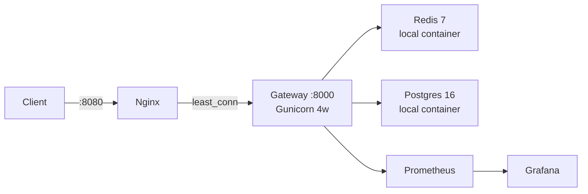
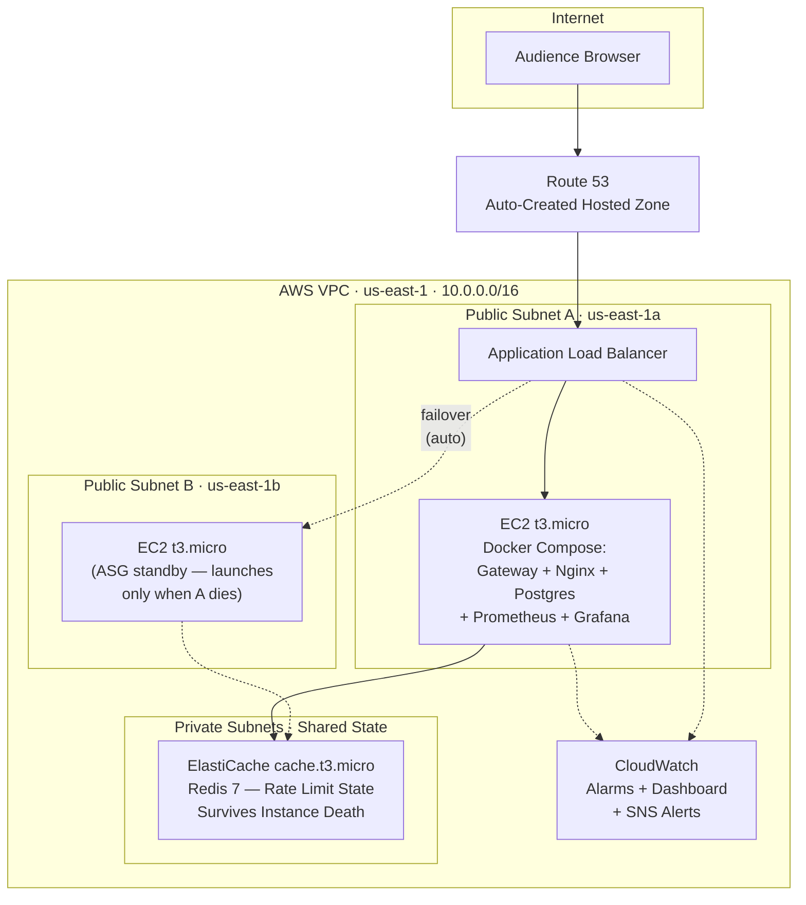
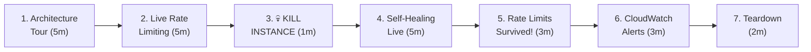

# Highly Available AWS Architecture — Final Implementation Plan

## Goal

Build the **HA infrastructure** for the Distributed Rate Limiter & API Gateway on AWS using Terraform — then **demo it live** by breaking things on purpose and watching the system heal itself.

```
terraform apply  →  run the demo (30–45 min)  →  terraform destroy
```

Every AWS resource is real. Every failure scenario is real.

> [!TIP]
> **Estimated cost for a 4-hour demo session**: ~$0.50 (Route 53 hosted zone). Run `terraform destroy` immediately after and the bill stops.

---

## Current State



Single machine. One death kills everything.

---

## Target Architecture



### What Lives Where

| Component | Location | Survives Instance Death? | Notes |
|---|---|---|---|
| Gateway + Nginx | Docker on EC2 | ❌ → ASG relaunches | Stateless, disposable |
| PostgreSQL | Docker on EC2 | ❌ → re-migrated + re-seeded | Demo only — no managed DB cost |
| **Redis (rate limits)** | **ElastiCache** | ✅ **YES** | Core demo point — shared state |
| Prometheus + Grafana | Docker on EC2 | ❌ → relaunches with instance | App-level metrics |
| **CloudWatch** | AWS managed | ✅ **YES** | Alarm history survives everything |
| **Route 53** | AWS managed | ✅ **YES** | DNS always resolves |

**The demo story**: _"Compute is disposable. Kill it. The ALB detects the failure, ASG launches a replacement, and the new instance connects to the same ElastiCache Redis — rate limit counters are still intact. Zero human intervention."_

---

## Resolved Decisions

| Decision | Answer |
|---|---|
| **Domain** | Auto-create Route 53 hosted zone + ACM cert |
| **Git repo** | `https://github.com/AyushSriva2598/APIGateway` (public) |
| **Demo data** | Auto-seed tiers + API keys via management command |
| **Admin panel** | Not needed — keys printed to bootstrap log |
| **IaC tool** | Terraform |
| **Region** | `us-east-1` |
| **Database** | Postgres in Docker on EC2 (no RDS) |
| **Monitoring** | Both CloudWatch AND Prometheus/Grafana |
| **CI/CD** | None (manual `terraform apply`) |

---

## User Review Required

> [!CAUTION]
> **Cleanup after demo**: Run `terraform destroy` immediately after the presentation. Forgetting to destroy risks a surprise bill (~$50-80/month if left running).

> [!WARNING]
> **Route 53 hosted zone**: Auto-created, but you'll need to update your domain registrar's nameservers to point at the Route 53 NS records for the domain to actually resolve. If you don't have a domain registrar, the ALB's auto-generated DNS name works fine as a fallback — no Route 53 needed.

> [!IMPORTANT]
> **SSH Key Pair**: You need an existing EC2 key pair in `us-east-1` for the live "kill Docker" demo. Create one in the AWS Console → EC2 → Key Pairs before running `terraform apply`.

---

## Proposed Changes

### Directory Structure

```
APIGateway/
├── ... (existing code — UNTOUCHED)
│
├── terraform/
│   ├── main.tf
│   ├── variables.tf
│   ├── outputs.tf
│   ├── terraform.tfvars.example
│   ├── versions.tf
│   │
│   ├── modules/
│   │   ├── networking/         # VPC, subnets, IGW, security groups
│   │   │   ├── main.tf
│   │   │   ├── variables.tf
│   │   │   └── outputs.tf
│   │   │
│   │   ├── compute/            # Launch template, ASG, ALB, IAM
│   │   │   ├── main.tf
│   │   │   ├── variables.tf
│   │   │   ├── outputs.tf
│   │   │   └── user_data.sh
│   │   │
│   │   ├── cache/              # ElastiCache Redis
│   │   │   ├── main.tf
│   │   │   ├── variables.tf
│   │   │   └── outputs.tf
│   │   │
│   │   ├── monitoring/         # CloudWatch alarms + dashboard + SNS
│   │   │   ├── main.tf
│   │   │   ├── variables.tf
│   │   │   └── outputs.tf
│   │   │
│   │   └── dns/                # Route 53 + ACM
│   │       ├── main.tf
│   │       ├── variables.tf
│   │       └── outputs.tf
│   │
│   └── scripts/
│       ├── deploy.sh
│       └── teardown.sh
│
├── docker-compose.prod.yml     # Prod compose (Postgres local, Redis external)
├── Dockerfile.prod             # Prod image
│
└── gateway/
    └── authentication/
        └── management/
            └── commands/
                └── seed_demo_data.py   # Auto-seeds tiers + API keys
```

**Total new files: ~24 files | Modified files: 0 (no existing code changes)**

---

### Component 1: Networking Module

**`terraform/modules/networking/`**

#### [NEW] `main.tf`

```hcl
data "aws_availability_zones" "available" {
  state = "available"
}

# ──── VPC ────
resource "aws_vpc" "main" {
  cidr_block           = var.vpc_cidr
  enable_dns_support   = true
  enable_dns_hostnames = true
  tags = { Name = "${var.project}-vpc" }
}

# ──── Public Subnets (2 AZs — ALB requirement) ────
resource "aws_subnet" "public" {
  count                   = 2
  vpc_id                  = aws_vpc.main.id
  cidr_block              = cidrsubnet(var.vpc_cidr, 8, count.index)
  availability_zone       = data.aws_availability_zones.available.names[count.index]
  map_public_ip_on_launch = true
  tags = { Name = "${var.project}-public-${count.index}" }
}

# ──── Private Subnets (ElastiCache) ────
resource "aws_subnet" "private" {
  count             = 2
  vpc_id            = aws_vpc.main.id
  cidr_block        = cidrsubnet(var.vpc_cidr, 8, count.index + 10)
  availability_zone = data.aws_availability_zones.available.names[count.index]
  tags = { Name = "${var.project}-private-${count.index}" }
}

# ──── Internet Gateway + Route Table ────
resource "aws_internet_gateway" "main" {
  vpc_id = aws_vpc.main.id
  tags   = { Name = "${var.project}-igw" }
}

resource "aws_route_table" "public" {
  vpc_id = aws_vpc.main.id
  route {
    cidr_block = "0.0.0.0/0"
    gateway_id = aws_internet_gateway.main.id
  }
  tags = { Name = "${var.project}-public-rt" }
}

resource "aws_route_table_association" "public" {
  count          = 2
  subnet_id      = aws_subnet.public[count.index].id
  route_table_id = aws_route_table.public.id
}

# ──── Security Groups ────

resource "aws_security_group" "alb" {
  name_prefix = "${var.project}-alb-"
  vpc_id      = aws_vpc.main.id
  description = "ALB — HTTP/HTTPS from internet"

  ingress {
    from_port   = 80
    to_port     = 80
    protocol    = "tcp"
    cidr_blocks = ["0.0.0.0/0"]
  }
  ingress {
    from_port   = 443
    to_port     = 443
    protocol    = "tcp"
    cidr_blocks = ["0.0.0.0/0"]
  }
  egress {
    from_port   = 0
    to_port     = 0
    protocol    = "-1"
    cidr_blocks = ["0.0.0.0/0"]
  }
  tags = { Name = "${var.project}-alb-sg" }
}

resource "aws_security_group" "gateway" {
  name_prefix = "${var.project}-gw-"
  vpc_id      = aws_vpc.main.id
  description = "Gateway EC2 — app from ALB, SSH + Grafana + Prometheus for demo"

  ingress {
    description     = "Nginx from ALB"
    from_port       = 8080
    to_port         = 8080
    protocol        = "tcp"
    security_groups = [aws_security_group.alb.id]
  }
  ingress {
    description = "SSH for demo kill"
    from_port   = 22
    to_port     = 22
    protocol    = "tcp"
    cidr_blocks = [var.demo_ssh_cidr]
  }
  ingress {
    description = "Grafana for audience"
    from_port   = 3000
    to_port     = 3000
    protocol    = "tcp"
    cidr_blocks = ["0.0.0.0/0"]
  }
  ingress {
    description = "Prometheus for audience"
    from_port   = 9090
    to_port     = 9090
    protocol    = "tcp"
    cidr_blocks = ["0.0.0.0/0"]
  }
  egress {
    from_port   = 0
    to_port     = 0
    protocol    = "-1"
    cidr_blocks = ["0.0.0.0/0"]
  }
  tags = { Name = "${var.project}-gw-sg" }
}

resource "aws_security_group" "redis" {
  name_prefix = "${var.project}-redis-"
  vpc_id      = aws_vpc.main.id
  description = "ElastiCache — from gateway SG only"

  ingress {
    from_port       = 6379
    to_port         = 6379
    protocol        = "tcp"
    security_groups = [aws_security_group.gateway.id]
  }
  tags = { Name = "${var.project}-redis-sg" }
}
```

#### [NEW] `variables.tf`

```hcl
variable "project"       { type = string }
variable "vpc_cidr"      { type = string, default = "10.0.0.0/16" }
variable "demo_ssh_cidr" { type = string, description = "Your IP/32 for SSH" }
```

#### [NEW] `outputs.tf`

```hcl
output "vpc_id"                    { value = aws_vpc.main.id }
output "public_subnet_ids"        { value = aws_subnet.public[*].id }
output "private_subnet_ids"       { value = aws_subnet.private[*].id }
output "alb_security_group_id"    { value = aws_security_group.alb.id }
output "gateway_security_group_id" { value = aws_security_group.gateway.id }
output "redis_security_group_id"  { value = aws_security_group.redis.id }
```

---

### Component 2: Cache Module (ElastiCache — Shared State)

**`terraform/modules/cache/`**

#### [NEW] `main.tf`

```hcl
resource "aws_elasticache_subnet_group" "main" {
  name       = "${var.project}-redis-subnet"
  subnet_ids = var.private_subnet_ids
}

resource "aws_elasticache_cluster" "redis" {
  cluster_id      = "${var.project}-redis"
  engine          = "redis"
  engine_version  = "7.0"
  node_type       = "cache.t3.micro"
  num_cache_nodes = 1

  subnet_group_name  = aws_elasticache_subnet_group.main.name
  security_group_ids = [var.redis_security_group_id]

  snapshot_retention_limit = 1
  snapshot_window          = "04:00-05:00"

  tags = { Name = "${var.project}-redis" }
}
```

#### [NEW] `variables.tf`

```hcl
variable "project"                 { type = string }
variable "private_subnet_ids"      { type = list(string) }
variable "redis_security_group_id" { type = string }
```

#### [NEW] `outputs.tf`

```hcl
output "endpoint"   { value = aws_elasticache_cluster.redis.cache_nodes[0].address }
output "port"       { value = aws_elasticache_cluster.redis.cache_nodes[0].port }
output "cluster_id" { value = aws_elasticache_cluster.redis.cluster_id }
```

---

### Component 3: Compute Module (ALB + ASG + Launch Template)

**`terraform/modules/compute/`**

#### [NEW] `main.tf`

```hcl
data "aws_ami" "amazon_linux" {
  most_recent = true
  owners      = ["amazon"]
  filter {
    name   = "name"
    values = ["al2023-ami-*-x86_64"]
  }
}

# ──── IAM ────
resource "aws_iam_role" "gateway" {
  name = "${var.project}-gateway-role"
  assume_role_policy = jsonencode({
    Version = "2012-10-17"
    Statement = [{
      Action    = "sts:AssumeRole"
      Effect    = "Allow"
      Principal = { Service = "ec2.amazonaws.com" }
    }]
  })
}

resource "aws_iam_role_policy_attachment" "cloudwatch" {
  role       = aws_iam_role.gateway.name
  policy_arn = "arn:aws:iam::aws:policy/CloudWatchAgentServerPolicy"
}

resource "aws_iam_role_policy_attachment" "ssm" {
  role       = aws_iam_role.gateway.name
  policy_arn = "arn:aws:iam::aws:policy/AmazonSSMManagedInstanceCore"
}

resource "aws_iam_instance_profile" "gateway" {
  name = "${var.project}-gateway-profile"
  role = aws_iam_role.gateway.name
}

# ──── ALB ────
resource "aws_lb" "gateway" {
  name               = "${var.project}-alb"
  internal           = false
  load_balancer_type = "application"
  security_groups    = [var.alb_security_group_id]
  subnets            = var.public_subnet_ids
  tags               = { Name = "${var.project}-alb" }
}

resource "aws_lb_target_group" "gateway" {
  name     = "${var.project}-tg"
  port     = 8080
  protocol = "HTTP"
  vpc_id   = var.vpc_id

  health_check {
    path                = "/healthz"
    port                = "8080"
    protocol            = "HTTP"
    healthy_threshold   = 2
    unhealthy_threshold = 3
    timeout             = 5
    interval            = 15
    matcher             = "200"
  }
  deregistration_delay = 30
}

resource "aws_lb_listener" "http" {
  load_balancer_arn = aws_lb.gateway.arn
  port              = 80
  protocol          = "HTTP"

  default_action {
    type             = "forward"
    target_group_arn = aws_lb_target_group.gateway.arn
  }
}

# ──── Launch Template ────
resource "aws_launch_template" "gateway" {
  name_prefix   = "${var.project}-lt-"
  image_id      = data.aws_ami.amazon_linux.id
  instance_type = "t3.micro"
  key_name      = var.key_pair_name

  vpc_security_group_ids = [var.gateway_security_group_id]

  iam_instance_profile {
    name = aws_iam_instance_profile.gateway.name
  }

  user_data = base64encode(templatefile("${path.module}/user_data.sh", {
    redis_host    = var.redis_host
    redis_port    = var.redis_port
    django_secret = var.django_secret_key
    allowed_hosts = var.allowed_hosts
  }))

  tag_specifications {
    resource_type = "instance"
    tags = { Name = "${var.project}-gateway" }
  }

  lifecycle { create_before_destroy = true }
}

# ──── ASG ────
resource "aws_autoscaling_group" "gateway" {
  name                = "${var.project}-asg"
  desired_capacity    = 1
  min_size            = 1
  max_size            = 2
  vpc_zone_identifier = var.public_subnet_ids
  target_group_arns   = [aws_lb_target_group.gateway.arn]

  launch_template {
    id      = aws_launch_template.gateway.id
    version = "$Latest"
  }

  health_check_type         = "ELB"
  health_check_grace_period = 180
  default_cooldown          = 120

  instance_refresh {
    strategy = "Rolling"
    preferences { min_healthy_percentage = 0 }
  }

  tag {
    key                 = "Name"
    value               = "${var.project}-gateway"
    propagate_at_launch = true
  }
}
```

#### [NEW] `user_data.sh`

```bash
#!/bin/bash
set -euo pipefail
exec > /var/log/user-data.log 2>&1

echo "=== Bootstrap started at $(date) ==="

# ── Docker + Compose ──
dnf update -y
dnf install -y docker git curl
systemctl enable docker && systemctl start docker
usermod -aG docker ec2-user

DOCKER_CONFIG=/usr/local/lib/docker/cli-plugins
mkdir -p $DOCKER_CONFIG
curl -SL "https://github.com/docker/compose/releases/latest/download/docker-compose-linux-x86_64" \
  -o $DOCKER_CONFIG/docker-compose
chmod +x $DOCKER_CONFIG/docker-compose

# ── Clone ──
cd /opt
git clone https://github.com/AyushSriva2598/APIGateway.git apigateway
cd apigateway

# ── Production env (Postgres=local container, Redis=ElastiCache) ──
cat > .env.prod <<EOF
DJANGO_SETTINGS_MODULE=config.settings.prod
DJANGO_SECRET_KEY=${django_secret}
ALLOWED_HOSTS=${allowed_hosts}
POSTGRES_DB=gateway
POSTGRES_USER=gateway
POSTGRES_PASSWORD=gateway-demo-2026
POSTGRES_HOST=postgres
POSTGRES_PORT=5432
REDIS_HOST=${redis_host}
REDIS_PORT=${redis_port}
EOF

# ── Launch ──
docker compose -f docker-compose.prod.yml --env-file .env.prod up -d --build

# ── Wait → Migrate → Seed ──
echo "Waiting for containers..."
sleep 25

docker compose -f docker-compose.prod.yml --env-file .env.prod exec -T gateway \
  python manage.py migrate --noinput 2>&1 || true

sleep 5

docker compose -f docker-compose.prod.yml --env-file .env.prod exec -T gateway \
  python manage.py migrate --noinput 2>&1 || true

# Auto-seed demo API keys (printed to this log)
docker compose -f docker-compose.prod.yml --env-file .env.prod exec -T gateway \
  python manage.py seed_demo_data 2>&1

echo "=== Bootstrap completed at $(date) ==="
echo ""
echo "============================================"
echo "  DEMO API KEYS (copy these for the demo):"
echo "============================================"
docker compose -f docker-compose.prod.yml --env-file .env.prod exec -T gateway \
  python manage.py seed_demo_data 2>&1 || echo "(keys already seeded above)"
```

#### [NEW] `variables.tf`

```hcl
variable "project"                    { type = string }
variable "vpc_id"                     { type = string }
variable "public_subnet_ids"          { type = list(string) }
variable "alb_security_group_id"      { type = string }
variable "gateway_security_group_id"  { type = string }
variable "key_pair_name"              { type = string }
variable "redis_host"                 { type = string }
variable "redis_port"                 { type = number }
variable "django_secret_key"          { type = string }
variable "allowed_hosts"              { type = string }
```

#### [NEW] `outputs.tf`

```hcl
output "alb_dns_name"            { value = aws_lb.gateway.dns_name }
output "alb_zone_id"             { value = aws_lb.gateway.zone_id }
output "alb_arn"                 { value = aws_lb.gateway.arn }
output "alb_arn_suffix"          { value = aws_lb.gateway.arn_suffix }
output "target_group_arn"        { value = aws_lb_target_group.gateway.arn }
output "target_group_arn_suffix" { value = aws_lb_target_group.gateway.arn_suffix }
output "asg_name"                { value = aws_autoscaling_group.gateway.name }
```

---

### Component 4: Production Docker Files

#### [NEW] `Dockerfile.prod`

```dockerfile
FROM python:3.12-slim

WORKDIR /app

RUN apt-get update && apt-get install -y --no-install-recommends curl && rm -rf /var/lib/apt/lists/*

COPY requirements/ requirements/
RUN pip install --no-cache-dir -r requirements/prod.txt

COPY gateway/ .

RUN python manage.py collectstatic --noinput 2>/dev/null || true

CMD ["gunicorn", "-w", "4", "-b", "0.0.0.0:8000", \
     "--access-logfile", "-", "--error-logfile", "-", \
     "--timeout", "30", "config.wsgi"]
```

#### [NEW] `docker-compose.prod.yml`

```yaml
# Production: Postgres = local (demo), Redis = ElastiCache (shared state)

services:
  postgres:
    image: postgres:16
    environment:
      POSTGRES_DB: ${POSTGRES_DB:-gateway}
      POSTGRES_USER: ${POSTGRES_USER:-gateway}
      POSTGRES_PASSWORD: ${POSTGRES_PASSWORD:-gateway}
    volumes: ["pgdata:/var/lib/postgresql/data"]
    healthcheck:
      test: ["CMD-SHELL", "pg_isready -U gateway"]
      interval: 5s
      retries: 5
    restart: always

  gateway:
    build:
      context: .
      dockerfile: Dockerfile.prod
    env_file: .env.prod
    depends_on:
      postgres: { condition: service_healthy }
    restart: always
    healthcheck:
      test: ["CMD", "curl", "-f", "http://localhost:8000/healthz"]
      interval: 10s
      retries: 3
      start_period: 30s

  nginx:
    image: nginx:alpine
    ports: ["8080:80"]
    volumes:
      - ./nginx/nginx.conf:/etc/nginx/nginx.conf:ro
    depends_on:
      gateway: { condition: service_healthy }
    restart: always

  prometheus:
    image: prom/prometheus
    ports: ["9090:9090"]
    volumes:
      - ./monitoring/prometheus/prometheus.yml:/etc/prometheus/prometheus.yml:ro
    restart: always

  grafana:
    image: grafana/grafana
    ports: ["3000:3000"]
    environment:
      - GF_SECURITY_ADMIN_PASSWORD=demo
      - GF_AUTH_ANONYMOUS_ENABLED=true
      - GF_AUTH_ANONYMOUS_ORG_ROLE=Viewer
    volumes:
      - ./monitoring/grafana/provisioning:/etc/grafana/provisioning
    restart: always

volumes:
  pgdata:
```

---

### Component 5: Demo Seed Management Command

#### [NEW] `gateway/authentication/management/commands/seed_demo_data.py`

This is a Django management command. Two parent directories (`management/` and `commands/`) need `__init__.py` files.

#### [NEW] `gateway/authentication/management/__init__.py` — empty file
#### [NEW] `gateway/authentication/management/commands/__init__.py` — empty file

#### [NEW] `gateway/authentication/management/commands/seed_demo_data.py`

```python
"""
Auto-seeds tiers + API keys for the live demo.
Idempotent — safe to run on every instance boot.

Usage: python manage.py seed_demo_data
Keys are printed to stdout (captured in /var/log/user-data.log).
"""
from django.core.management.base import BaseCommand
from authentication.models import Tier, APIKey


class Command(BaseCommand):
    help = "Seed demo tiers and API keys for the presentation"

    def handle(self, *args, **options):
        self.stdout.write("\n── Seeding Demo Data ──\n")

        # ── Tiers ──
        free_tier, _ = Tier.objects.get_or_create(
            name="free",
            defaults=dict(algorithm="token_bucket", capacity=10, refill_rate=10 / 60),
        )
        pro_tier, _ = Tier.objects.get_or_create(
            name="pro",
            defaults=dict(algorithm="sliding_window", limit=100, window_seconds=60),
        )
        ent_tier, _ = Tier.objects.get_or_create(
            name="enterprise",
            defaults=dict(algorithm="fixed_window", limit=1000, window_seconds=60),
        )
        self.stdout.write(f"  Tiers: free, pro, enterprise ✓")

        # ── API Keys ──
        for tier, owner in [
            (free_tier, "demo-free"),
            (pro_tier, "demo-pro"),
            (ent_tier, "demo-enterprise"),
        ]:
            if not APIKey.objects.filter(owner=owner).exists():
                raw_key, key_hash, key_prefix = APIKey.generate_key()
                APIKey.objects.create(
                    key_hash=key_hash,
                    key_prefix=key_prefix,
                    owner=owner,
                    tier=tier,
                )
                self.stdout.write(self.style.SUCCESS(
                    f"  ✅ {owner:20s} → {raw_key}"
                ))
            else:
                existing = APIKey.objects.get(owner=owner)
                self.stdout.write(f"  ⏭  {owner:20s} → already exists ({existing.key_prefix}...)")

        self.stdout.write(self.style.SUCCESS("\n  Demo data ready!\n"))
```

---

### Component 6: Monitoring Module (CloudWatch + Prometheus/Grafana)

**`terraform/modules/monitoring/`**

#### [NEW] `main.tf`

```hcl
resource "aws_sns_topic" "alerts" {
  name = "${var.project}-alerts"
}

resource "aws_sns_topic_subscription" "email" {
  topic_arn = aws_sns_topic.alerts.arn
  protocol  = "email"
  endpoint  = var.alert_email
}

# ──── CloudWatch Dashboard ────
resource "aws_cloudwatch_dashboard" "main" {
  dashboard_name = "${var.project}-dashboard"
  dashboard_body = jsonencode({
    widgets = [
      {
        type = "metric"
        x = 0, y = 0, width = 12, height = 6
        properties = {
          title   = "ALB Request Count"
          metrics = [["AWS/ApplicationELB", "RequestCount", "LoadBalancer", var.alb_arn_suffix]]
          period  = 60, stat = "Sum", region = var.region
        }
      },
      {
        type = "metric"
        x = 12, y = 0, width = 12, height = 6
        properties = {
          title = "Healthy vs Unhealthy Hosts"
          metrics = [
            ["AWS/ApplicationELB", "HealthyHostCount",   "TargetGroup", var.target_group_arn_suffix, "LoadBalancer", var.alb_arn_suffix],
            ["AWS/ApplicationELB", "UnHealthyHostCount", "TargetGroup", var.target_group_arn_suffix, "LoadBalancer", var.alb_arn_suffix]
          ]
          period = 60, stat = "Maximum", region = var.region
        }
      },
      {
        type = "metric"
        x = 0, y = 6, width = 12, height = 6
        properties = {
          title   = "EC2 CPU Utilization"
          metrics = [["AWS/EC2", "CPUUtilization", "AutoScalingGroupName", var.asg_name]]
          period  = 60, stat = "Average", region = var.region
        }
      },
      {
        type = "metric"
        x = 12, y = 6, width = 12, height = 6
        properties = {
          title   = "ALB Response Time (p95)"
          metrics = [["AWS/ApplicationELB", "TargetResponseTime", "LoadBalancer", var.alb_arn_suffix]]
          period  = 60, stat = "p95", region = var.region
        }
      },
      {
        type = "metric"
        x = 0, y = 12, width = 12, height = 6
        properties = {
          title = "ElastiCache CPU & Memory"
          metrics = [
            ["AWS/ElastiCache", "CPUUtilization", "CacheClusterId", var.cache_cluster_id],
            ["AWS/ElastiCache", "DatabaseMemoryUsagePercentage", "CacheClusterId", var.cache_cluster_id]
          ]
          period = 60, region = var.region
        }
      },
      {
        type = "metric"
        x = 12, y = 12, width = 12, height = 6
        properties = {
          title   = "ALB 5xx Errors"
          metrics = [["AWS/ApplicationELB", "HTTPCode_ELB_5XX_Count", "LoadBalancer", var.alb_arn_suffix]]
          period  = 60, stat = "Sum", region = var.region
        }
      }
    ]
  })
}

# ──── Alarms ────

resource "aws_cloudwatch_metric_alarm" "unhealthy_hosts" {
  alarm_name          = "${var.project}-unhealthy-hosts"
  alarm_description   = "Fires when gateway instance dies"
  comparison_operator = "GreaterThanThreshold"
  evaluation_periods  = 1
  metric_name         = "UnHealthyHostCount"
  namespace           = "AWS/ApplicationELB"
  period              = 60
  statistic           = "Maximum"
  threshold           = 0
  alarm_actions       = [aws_sns_topic.alerts.arn]
  ok_actions          = [aws_sns_topic.alerts.arn]

  dimensions = {
    TargetGroup  = var.target_group_arn_suffix
    LoadBalancer = var.alb_arn_suffix
  }
}

resource "aws_cloudwatch_metric_alarm" "high_cpu" {
  alarm_name          = "${var.project}-high-cpu"
  alarm_description   = "Fires during load test"
  comparison_operator = "GreaterThanThreshold"
  evaluation_periods  = 2
  metric_name         = "CPUUtilization"
  namespace           = "AWS/EC2"
  period              = 120
  statistic           = "Average"
  threshold           = 70
  alarm_actions       = [aws_sns_topic.alerts.arn]

  dimensions = { AutoScalingGroupName = var.asg_name }
}

resource "aws_cloudwatch_metric_alarm" "alb_5xx" {
  alarm_name          = "${var.project}-alb-5xx"
  alarm_description   = "Fires when ALB returns 502/503 during instance death"
  comparison_operator = "GreaterThanThreshold"
  evaluation_periods  = 1
  metric_name         = "HTTPCode_ELB_5XX_Count"
  namespace           = "AWS/ApplicationELB"
  period              = 60
  statistic           = "Sum"
  threshold           = 5
  treat_missing_data  = "notBreaching"
  alarm_actions       = [aws_sns_topic.alerts.arn]

  dimensions = { LoadBalancer = var.alb_arn_suffix }
}
```

#### [NEW] `variables.tf`

```hcl
variable "project"                 { type = string }
variable "region"                  { type = string }
variable "alert_email"             { type = string }
variable "alb_arn_suffix"          { type = string }
variable "target_group_arn_suffix" { type = string }
variable "asg_name"                { type = string }
variable "cache_cluster_id"        { type = string }
```

#### [NEW] `outputs.tf`

```hcl
output "dashboard_url" {
  value = "https://${var.region}.console.aws.amazon.com/cloudwatch/home?region=${var.region}#dashboards:name=${var.project}-dashboard"
}
output "sns_topic_arn" { value = aws_sns_topic.alerts.arn }
```

---

### Component 7: DNS Module (Route 53 + ACM)

**`terraform/modules/dns/`**

#### [NEW] `main.tf`

```hcl
resource "aws_route53_zone" "main" {
  count = var.domain_name != "" ? 1 : 0
  name  = var.domain_name
  tags  = { Name = "${var.project}-zone" }
}

resource "aws_acm_certificate" "main" {
  count             = var.domain_name != "" ? 1 : 0
  domain_name       = var.domain_name
  validation_method = "DNS"
  tags              = { Name = "${var.project}-cert" }
  lifecycle { create_before_destroy = true }
}

resource "aws_route53_record" "cert_validation" {
  for_each = var.domain_name != "" ? {
    for dvo in aws_acm_certificate.main[0].domain_validation_options : dvo.domain_name => {
      name   = dvo.resource_record_name
      record = dvo.resource_record_value
      type   = dvo.resource_record_type
    }
  } : {}

  zone_id = aws_route53_zone.main[0].zone_id
  name    = each.value.name
  type    = each.value.type
  records = [each.value.record]
  ttl     = 60
}

resource "aws_acm_certificate_validation" "main" {
  count                   = var.domain_name != "" ? 1 : 0
  certificate_arn         = aws_acm_certificate.main[0].arn
  validation_record_fqdns = [for r in aws_route53_record.cert_validation : r.fqdn]
}

resource "aws_route53_record" "alb_alias" {
  count   = var.domain_name != "" ? 1 : 0
  zone_id = aws_route53_zone.main[0].zone_id
  name    = var.domain_name
  type    = "A"

  alias {
    name                   = var.alb_dns_name
    zone_id                = var.alb_zone_id
    evaluate_target_health = true
  }
}

resource "aws_lb_listener" "https" {
  count             = var.domain_name != "" ? 1 : 0
  load_balancer_arn = var.alb_arn
  port              = 443
  protocol          = "HTTPS"
  ssl_policy        = "ELBSecurityPolicy-TLS13-1-2-2021-06"
  certificate_arn   = aws_acm_certificate_validation.main[0].certificate_arn

  default_action {
    type             = "forward"
    target_group_arn = var.target_group_arn
  }
}
```

#### [NEW] `variables.tf`

```hcl
variable "project"          { type = string }
variable "domain_name"      { type = string, default = "" }
variable "alb_dns_name"     { type = string }
variable "alb_zone_id"      { type = string }
variable "alb_arn"          { type = string }
variable "target_group_arn" { type = string }
```

#### [NEW] `outputs.tf`

```hcl
output "nameservers" {
  value       = var.domain_name != "" ? aws_route53_zone.main[0].name_servers : []
  description = "Point your domain registrar NS records to these"
}

output "domain_url" {
  value = var.domain_name != "" ? "https://${var.domain_name}" : "N/A (no domain configured)"
}
```

---

### Component 8: Root Module + Scripts

#### [NEW] `terraform/versions.tf`

```hcl
terraform {
  required_version = ">= 1.5"
  required_providers {
    aws = {
      source  = "hashicorp/aws"
      version = "~> 5.0"
    }
  }
}
```

#### [NEW] `terraform/main.tf`

```hcl
provider "aws" {
  region = var.region
}

module "networking" {
  source        = "./modules/networking"
  project       = var.project
  vpc_cidr      = var.vpc_cidr
  demo_ssh_cidr = var.demo_ssh_cidr
}

module "cache" {
  source                  = "./modules/cache"
  project                 = var.project
  private_subnet_ids      = module.networking.private_subnet_ids
  redis_security_group_id = module.networking.redis_security_group_id
}

module "compute" {
  source                    = "./modules/compute"
  project                   = var.project
  vpc_id                    = module.networking.vpc_id
  public_subnet_ids         = module.networking.public_subnet_ids
  alb_security_group_id     = module.networking.alb_security_group_id
  gateway_security_group_id = module.networking.gateway_security_group_id
  key_pair_name             = var.key_pair_name
  redis_host                = module.cache.endpoint
  redis_port                = module.cache.port
  django_secret_key         = var.django_secret_key
  allowed_hosts             = var.allowed_hosts
}

module "monitoring" {
  source                 = "./modules/monitoring"
  project                = var.project
  region                 = var.region
  alert_email            = var.alert_email
  target_group_arn_suffix = module.compute.target_group_arn_suffix
  alb_arn_suffix         = module.compute.alb_arn_suffix
  asg_name               = module.compute.asg_name
  cache_cluster_id       = module.cache.cluster_id
}

module "dns" {
  source           = "./modules/dns"
  project          = var.project
  domain_name      = var.domain_name
  alb_dns_name     = module.compute.alb_dns_name
  alb_zone_id      = module.compute.alb_zone_id
  alb_arn          = module.compute.alb_arn
  target_group_arn = module.compute.target_group_arn
}
```

#### [NEW] `terraform/variables.tf`

```hcl
variable "project"           { type = string, default = "apigateway" }
variable "region"            { type = string, default = "us-east-1" }
variable "vpc_cidr"          { type = string, default = "10.0.0.0/16" }
variable "demo_ssh_cidr"     { type = string, description = "Your IP/32" }
variable "key_pair_name"     { type = string, description = "EC2 key pair in us-east-1" }
variable "django_secret_key" { type = string, sensitive = true }
variable "allowed_hosts"     { type = string, default = "*" }
variable "alert_email"       { type = string }
variable "domain_name"       { type = string, default = "", description = "Leave empty to skip Route 53" }
```

#### [NEW] `terraform/outputs.tf`

```hcl
output "alb_url" {
  value = "http://${module.compute.alb_dns_name}"
}

output "health_check" {
  value = "curl -s http://${module.compute.alb_dns_name}/healthz | jq ."
}

output "cloudwatch_dashboard" {
  value = module.monitoring.dashboard_url
}

output "domain_url" {
  value = module.dns.domain_url
}

output "route53_nameservers" {
  value       = module.dns.nameservers
  description = "Update your domain registrar NS records to these"
}

output "teardown" {
  value = "terraform destroy -auto-approve"
}
```

#### [NEW] `terraform/terraform.tfvars.example`

```hcl
project           = "apigateway"
region            = "us-east-1"
vpc_cidr          = "10.0.0.0/16"
demo_ssh_cidr     = "YOUR_IP/32"                 # Run: curl -s ifconfig.me
key_pair_name     = "your-keypair-name"           # Must exist in us-east-1
django_secret_key = "change-me-random-string-42"
allowed_hosts     = "*"
alert_email       = "your-email@example.com"

# DNS (leave empty to skip Route 53)
domain_name       = ""
```

#### [NEW] `terraform/scripts/deploy.sh`

```bash
#!/bin/bash
set -euo pipefail
cd "$(dirname "$0")/.."

echo "╔══════════════════════════════════════════════════╗"
echo "║  API Gateway — HA Architecture Demo Deployment  ║"
echo "╚══════════════════════════════════════════════════╝"
echo ""
terraform init
echo ""
terraform plan -out=demo.tfplan
echo ""
read -p "Apply? (yes/no): " confirm
if [ "$confirm" = "yes" ]; then
  terraform apply demo.tfplan
  echo ""
  echo "════════════════════════════════════════"
  echo "  ✅ DEPLOYMENT COMPLETE"
  echo "════════════════════════════════════════"
  terraform output
  echo ""
  echo "⚠️  Run ./scripts/teardown.sh after the demo!"
else
  echo "Aborted."
fi
```

#### [NEW] `terraform/scripts/teardown.sh`

```bash
#!/bin/bash
set -euo pipefail
cd "$(dirname "$0")/.."

echo "╔══════════════════════════════════════════════╗"
echo "║  DESTROYING ALL DEMO INFRASTRUCTURE          ║"
echo "╚══════════════════════════════════════════════╝"

terraform destroy -auto-approve

echo "✅ All resources destroyed. AWS bill stops now."
```

---

## 🎬 Live Demo Playbook (~30 minutes)

### Pre-Demo (30 min before)

```bash
cd terraform && ./scripts/deploy.sh                # ~8-10 min

ALB=$(terraform output -raw alb_url)
curl -s $ALB/healthz | jq .                        # {"status":"ok",...}

# Get API keys from bootstrap log
ssh -i ~/.ssh/key.pem ec2-user@<ip>
cat /var/log/user-data.log | grep "demo-"          # Shows raw keys
exit

# Confirm SNS email subscription (check inbox)
# Open tabs: ALB/healthz, CloudWatch dashboard, Grafana, EC2 console
```

### Demo Flow



### Scene 1: "The Architecture" (5 min)
Show AWS Console: VPC, 2 AZs, ALB, ASG, ElastiCache. Show Terraform code briefly.
> "One command: `terraform apply`. Zero console clicking. Every resource in version-controlled code."

### Scene 2: "Rate Limiting Works" (5 min)
```bash
# Burst 15 requests with free-tier key (limit=10)
for i in $(seq 1 15); do
  curl -s -o /dev/null -w "%{http_code} " -H "X-API-Key: <KEY>" $ALB/api/users/1
done
# 200 200 200 ... 429 429 429
```
Show Grafana: `gateway_rate_limit_decisions_total` split by allowed/rejected.

### Scene 3: 💀 "Kill It" (1 min)
```bash
ssh -i key.pem ec2-user@<ip>
sudo systemctl stop docker
exit
```
> "Docker is dead. Gateway, Nginx, Postgres, Grafana — all dead."

### Scene 4: "Self-Healing" (5 min)
Watch in real-time:
- Target Group: healthy → unhealthy
- CloudWatch: UnHealthyHostCount spikes
- `curl $ALB/healthz` → 502
- EC2 Console: old instance terminates, **new one launches in other AZ**
- ~3 min later: new target → healthy
- `curl $ALB/healthz` → 200 🎉

> "Zero human intervention. ASG detected the failure via ALB health check, killed the dead instance, launched a fresh one, and the ALB registered it."

### Scene 5: "State Survived" (3 min)
```bash
curl -H "X-API-Key: <KEY>" $ALB/api/users/1    # Key works (re-seeded)
# Rate limit counters in ElastiCache survived the instance death
```
> "Compute is disposable. The rate limit state lives in ElastiCache — it never went down."

### Scene 6: "Alerts" (3 min)
Show email: ALARM → OK. Show CloudWatch alarm history.

### Scene 7: "Teardown" (2 min)
```bash
terraform destroy -auto-approve
```
> "One command. Everything gone. Bill stops. `terraform apply` recreates it identically tomorrow."

---

## Failure Matrix (Q&A reference)

| Failure | Recovery | Downtime | Survives |
|---|---|---|---|
| EC2 crash / Docker dies | ASG replaces via ALB health check | ~4 min | ElastiCache, CloudWatch |
| Application OOM | ASG replaces | ~4 min | ElastiCache, CloudWatch |
| AZ-a outage | ASG launches in AZ-b | ~4 min | ElastiCache, CloudWatch |
| ElastiCache restart | AWS auto-restart, LRU fallback | ~2-3 min | Counters may reset |
| Postgres (on-instance) | Re-migrated + re-seeded on new instance | Seeded fresh | N/A (demo, disposable) |
| Bad deploy | Health check never passes → ASG retries | Varies | ElastiCache, CloudWatch |

---

## Verification Plan

### Automated Tests
```bash
cd terraform && terraform init && terraform validate && terraform plan
cd .. && docker compose up -d && pytest --cov && docker compose down
```

### Manual Dry Run
1. `./scripts/deploy.sh` → outputs appear
2. `curl /healthz` → 200
3. Kill Docker → ASG replaces → 200 returns
4. CloudWatch alarm fires + email + OK
5. Grafana at `:3000`
6. `./scripts/teardown.sh` → clean

---

## Implementation Phases

| Phase | What | Time |
|---|---|---|
| **1** | Networking module | 30 min |
| **2** | Cache module (ElastiCache) | 15 min |
| **3** | Seed command + Production Docker files | 25 min |
| **4** | Compute module (ALB + ASG + user_data) | 45 min |
| **5** | Monitoring module (CloudWatch) | 25 min |
| **6** | DNS module (Route 53 + ACM) | 15 min |
| **7** | Root module + variables + scripts | 20 min |

**Total: ~3 hours implementation + ~10 min dry-run deploy**
